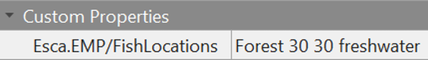

# EMP Modding Guide
This guide explains how to use features from Esca's Modding Plugins (EMP) in other mods for Stardew Valley.

See [the main readme](readme.md) for other information about EMP.

## Contents (Game Mechanics)
* [Bed Placement](#bed-placement)
  * [Pass Out Safely](#pass-out-safely)
* [Custom Order Boards](#custom-order-boards)
* [Destroyable Bushes](#destroyable-bushes)
* [Fish Locations](#fish-locations)
  * [Using tile properties](#using-tile-properties)
  * [Using the data asset](#using-the-data-asset)
* [Kitchen Features](#kitchen-features)
  * [Allow Mini-Fridges](#allow-mini-fridges)
* [Water Color](#water-color)

## Contents (Modding Utilities)
* [Content Patcher Tokens](#content-patcher-tokens)
  * [Game State Query](#game-state-query)
  * [Mod Data](#mod-data)
  * [Mod Data Keys](#mod-data-keys)
  * [Player Stats](#player-stats)
* [Game State Queries](#game-state-queries)
  * [Can Player Move](#can-player-move)
  * [Is Player Free](#is-player-free)
  * [Is Split Screen](#is-split-screen)
  * [Is World Ready](#is-world-ready)
* [Trigger Actions](#trigger-actions)
  * [Log Message](#log-message)
* [Triggers](#triggers)
  * [Game Launched](#game-launched)
  * [One Second Update Ticked](#one-second-update-ticked)
  * [Returned to Title](#returned-to-title)
  * [Save Loaded](#save-loaded)
  * [Time Changed](#time-changed)


# Game Mechanics

## Bed Placement
This feature allows players to place moveable (furniture) beds at additional locations.

To enable bed placement at a location, add the map property `Esca.EMP/BedPlacement` and set its value to `true`:


### Pass Out Safely
This feature prevents certain penalties if players pass out from exhaustion (stamina loss) at specified locations, similar to when players pass out inside the farmhouse.

Note that this specifically prevents money loss and receiving a letter about being rescued by an NPC; it does not prevent reduced stamina the next morning.

To enable this feature at a location, add the map property `Esca.EMP/PassOutSafely` and set its value to `true`:


## Custom Order Boards
This feature allows mods to add new Special Orders boards that only display orders from a custom category ("OrderType"). See the wiki's guide to the [Data/SpecialOrders](https://stardewvalleywiki.com/Modding:Special_orders) asset for information about creating special orders.

EMP adds a new value for the `Buildings`-layer `Action` tile property: `Esca.EMP/CustomBoard <OrderType>`

Tiles with this `Action` property value will open the Special Orders board and display random available orders with the specified "OrderType".

The order type must start with "Esca.EMP/". For example, you could add new special orders set to  `"OrderType": "Esca.EMP/YourModName"` or `"OrderType": "Esca.EMP/YourModName/CropOrders"`

Adding `true` at the end of the tile property's value will display a floating "!" icon when new special orders are available. If your board takes up more than one tile, you should generally use "true" only on a single tile (e.g. the middle of the board).

Below is an example of a tile that opens a Special Orders board with type "Esca.EMP/YourModName" and displays a "!" indicator:


See the Stardew Valley Wiki's section on [tile properties](https://stardewvalleywiki.com/Modding:Maps#Tile_properties_2) for more information about `Action` tile properties. Note that this property must be on the `Buildings` layer, and a tile must exist on that layer to give it properties.

* **This feature was commissioned by Lumina/Lumisteria!**

## Destroyable Bushes
This feature allows players to destroy bushes at specific locations or tiles.

Players must use an axe that has been upgraded at least once (Copper Axe or better) to destroy bushes. Destroyed bushes will not regrow; players can use mods such as [Destroyable Bushes](https://www.nexusmods.com/stardewvalley/mods/6304) or [Reset Terrain Features](https://www.nexusmods.com/stardewvalley/mods/4715) for more control over this.

To enable bush destruction at a location or tile, use the map/tile property `Esca.EMP/DestroyableBushes` and set its value to `true`.

Note that if the location and tile both have this property, the tile property will be used. For example, you can set the map property to `true` and a tile property to `false`; this will allow all bushes at the location to be destroyed except on that specific tile.


## Fish Locations
This feature allows players to catch different groups of fish at a single in-game location (a.k.a. map). It gives mods a simple way to control which fish are used from the [Data/Locations](https://stardewvalleywiki.com/Modding:Location_data) asset. It can also control what crab pots will catch from the [Data/Fish](https://stardewvalleywiki.com/Modding:Fish_data) asset (e.g. ocean, freshwater, or custom types).

Mods can use this feature with two different methods: editing a data asset or using tile properties. See each section below for more information.

The asset has higher priority, so if both the asset and tile property are used for the same tile, the asset's settings will be used.

### Using tile properties
Fish locations can be controlled with this `Back`-layer tile property: `Esca.EMP/FishLocations`

The property's value uses this format: `<UseLocation> [UseTile] [UseCrabPotTypes]`

Field | Value | Example | Required? | Description
------|-------|---------|-----------|------------
UseLocation | A location name or "null" | `Mountain` | Required | Fish caught here will come from this location's data. If the word "null" is used, the location won't be changed. Refer to the keys (location names) in Data/Locations, but note that every farm type uses the name "Farm" in-game.
UseTile | X and Y integers | `50 20` | Optional | Fish caught here will come from this tile's data instead. In some cases, this can be used to control which fish area is used in Data/Locations.
UseCrabPotTypes | "freshwater", "ocean", or custom crab types | `ocean` | Optional | **These names are case-sensitive.** Crab pots at this tile will catch any "trap" results with these type names in Data/Fish. Stardew's official types are "freshwater" and "ocean". Multiple types can be used, separated by spaces.

Below is an example tile property where fish will be caught from the Forest's pond, and pots will catch "freshwater" results: `Forest 30 30 freshwater`



### Using the data asset
EMP adds this data asset to Stardew: `"Mods/Esca.EMP/FishLocations"`

The asset can be edited with Content Patcher's "EditData" action like any other data asset. SMAPI (C#) mods can also edit the asset with "IAssetEditor" methods.

Below is an example content.json file for a Content Patcher mod. This example changes some areas of the Farm to catch fish from the Forest's pond, and crab pots there will catch "freshwater" results.
```js
{
  "Format": "2.4.0",
  "Changes": [
    {
      "Action": "EditData",
      "Target": "Mods/Esca.EMP/FishLocations",
      "Entries": {
        "YourName.ExampleMod 1": {  /* give the entry a unique key */
          "Locations": [ "Farm" ],    /* this entry affects the farm */
          "TileAreas": [
            {"X":0, "Y":0, "Width": 50, "Height": 50}, /* this entry affects tiles 0,0 - 49,49 */
            {"X":80, "Y":90, "Width": 2, "Height": 4}  /* this entry affects tiles 80,90 - 81,93 */
          ],
          "UseLocation": "Forest",  /* use fish from the "Forest" data in Data/Locations */
          "UseTile": {"X": 30, "Y": 30}, /* use fish from this tile, which is in the forest's lake */
          "UseCrabPotTypes": ["freshwater"], /* use crabs from the freshwater category in Data/Fish */
        }
      }
    }
  ]
}
```

Each entry in this asset can include the following fields:

Field | Value | Example | Required? | Description
------|-------|---------|-----------|------------
(entry key) | Any unique string | `"YourName.ExampleMod 1"` | Required | A unique key for this entry. Including your mod's [UniqueID](https://www.stardewvalleywiki.com/Modding:Modder_Guide/APIs/Manifest) is recommended.
Locations | A list of location names | `["Farm", "BusStop"]` | Required | A list of locations (maps) this entry will affect. Refer to the keys (location names) in Data/Locations, but note that every farm type uses the name "Farm" in-game.
TileAreas | A list of tile areas | `[ {"X":0, "Y":0, "Width":999, "Height":999} ]` | Required | A list of tile areas this entry will affect. The earlier example will affect the entire map.
UseLocation | A location name | `"Mountain"` | Optional | Fish caught here will come from this location's data. Refer to the keys (location names) in Data/Locations.
UseTile | X and Y integers | `{"X": 50, "Y": 20}` | Optional | Fish caught here will come from this tile's data instead. In some cases, this can be used to control which fish area is used in Data/Locations.
UseCrabPotTypes | A list of crab type names | `ocean` | Optional | **These names are case-sensitive.** Crab pots at this tile will catch any "trap" results with these type names in Data/Fish. Stardew's official types are "freshwater" and "ocean".
Priority | Any integer | `0` | Optional | If a tile is affected by more than one entry, the entry will the highest priority will be used. 0 if not provided.

## Kitchen Features
These features allow mods to add functional kitchens to locations other than the farmhouse.

The main feature is a new value for the `Buildings`-layer `Action` tile property: `Esca.EMP/CustomKitchen`

Tiles with this `Action` property value will open the cooking menu, similar to the stove in an upgraded farmhouse. This works at any location and will use ingredients in the player's inventory, [Mini-Fridges](https://stardewvalleywiki.com/Mini-Fridge) at the same location, and modded chests with `fridge` set to `true`.

Below is an example of how to use this tile property: `Action` `Esca.EMP/Kitchen`


See the Stardew Valley Wiki's section on [tile properties](https://stardewvalleywiki.com/Modding:Maps#Tile_properties_2) for more information about `Action` tile properties. Note that this property must be on the `Buildings` layer, and a tile must exist on that layer to give it properties.

### Allow Mini Fridges
This feature allows players to place [Mini-Fridges](https://stardewvalleywiki.com/Mini-Fridge) in locations other than the farmhouse, which can make it easier to use the cooking menu.

To enable mini-fridge placement at a location, add the map property `Esca.EMP/AllowMiniFridges` and set its value to `true`:


## Water Color
This feature allows mods to change the color of water at a location.

To use this feature at a location, add the map property `Esca.EMP/WaterColor` and give it one of the following values:

* The name of a color from [C#'s KnownColor list](https://docs.microsoft.com/en-us/dotnet/api/system.drawing.knowncolor). Example: `Esca.EMP/WaterColor` `Red`
* RGB values from 0 to 255, separated by spaces. Example: `Esca.EMP/WaterColor` `255 0 0`
* RGBA values from 0 to 255, separated by spaces. Example: `Esca.EMP/WaterColor` `255 0 0 255`


# Modding Utilities

## Content Patcher Tokens
EMP adds the following custom tokens to Content Patcher. To enable them, you must do at least **one** of the following:

A) Add EMP as a dependency in your mod's "manifest.json" file: `"Dependencies": [{"UniqueID": "Esca.EMP"}]`

B) Whenever you use a token from EMP, add this "When" condition: `"HasMod": "Esca.EMP"`

### Game State Query
The `Esca.EMP/GameStateQuery` token can be used to check a [game state query (GSQ)](https://stardewvalleywiki.com/Modding:Game_state_queries) in Content Patcher. It returns either "True" or "False". It's only active while a save is fully loaded.

Note that this token uses the same update rates as other tokens. Its value will only change at the specified update rate for your patch (at the start of each day, by default). GSQs might also be slightly slower than other tokens, so if another token can achieve the same goal, use that instead.

Format example:

```js
{
  "Format": "2.4.0",
  "Changes": [
    {
      "LogName": "Edit object sprites while the Night Market is open",
      "Action": "EditImage",
      "Target": "Maps/springobjects",
      "FromFile": "assets/My_Edited_SpringObjects.png",
      "When": {
        "Esca.EMP/GameStateQuery: IS_PASSIVE_FESTIVAL_OPEN NightMarket": "true"
      },
      "Update": "OnTimeChange"
    }
  ]
}
```

### Mod Data
The `Esca.EMP/ModData` token can be used to read text from the "mod data" field attached to certain in-game objects, where mods can store custom data that persists in the save file. This token outputs whatever text is stored in the target's modData with the given key; if no data exists, the text is blank.

Token format: `{{Esca.EMP/ModData: <Target> <Key>}}`

`<Target>` should be either `Farm` or `Player`. "Farm" will use the Farm location's mod data; this is shared by everyone in multiplayer, if the same key is used. "Player" will read from the local player's data instead, so the same key will have different data for each player.

`<Key>` is the unique ID for a specific entry in the mod data. Since mod data is shared by all mods, keys should start with a mod's unique ID, e.g. `Esca.TestMod_MyCustomText`.

C# mods can read and edit the farm's data with `Game1.getFarm().modData`, or the current player's data with `Game1.player.modData`. The mod [BETAS](https://www.nexusmods.com/stardewvalley/mods/27100) also adds trigger actions to edit mod data.

Format example:

```cs
//somewhere in a C# mod, do this:
Game1.getFarm().modData["Esca.TestMod_MyCustomData"] = "Hi, world...";
```

```js
{
  "Format": "2.4.0",
  "Changes": [
    {
      "LogName": "Repeatedly show a console message with text from mod data",
      "Action": "EditData",
      "Target": "Data/TriggerActions",
      "Entries": {
        "{{ModId}}_LogModData": {
            "Id": "{{ModId}}_LogModData",
            "Trigger": "LocationChanged",
            "Action": "Esca.EMP_LogMessage Info {{ModId}}: Reading shared mod data from the farm. Text: {{Esca.EMP/ModData: Farm Esca.TestMod_MyCustomData}}",
            "MarkActionApplied": false
        }
      }
    }
  ]
}
```

Log output: `[00:00:00 INFO  Esca's Modding Plugins] Esca.TestMod: Reading shared mod data from the farm. Text: Hi, world...`

### Mod Data Keys
The `Esca.EMP/ModDataKeys` token outputs existing keys in the "mod data" field attached to certain in-game objects, where mods can store custom data that persists in the save file. This token can be used to check whether specific keys exist.

Token format: `{{Esca.EMP/ModDataKeys: <Target>}}`

`<Target>` should be either `Farm` or `Player`. "Farm" will use the Farm location's mod data; this is shared by everyone in multiplayer, if the same key is used. "Player" will read from the local player's data instead, so the same key will have different data for each player.

C# mods can read and edit the farm's data with `Game1.getFarm().modData`, or the current player's data with `Game1.player.modData`. The mod [BETAS](https://www.nexusmods.com/stardewvalley/mods/27100) also adds trigger actions to edit mod data.

Format example:

```cs
//somewhere in a C# mod, do this:
Game1.getFarm().modData["Esca.TestMod_MyCustomData"] = "random text here!";
```

```js
{
  "Format": "2.4.0",
  "Changes": [
    {
      "LogName": "Edit object sprites when a mod data key exists",
      "Action": "EditImage",
      "Target": "Maps/springobjects",
      "FromFile": "assets/My_Edited_SpringObjects.png",
      "When": {
        "Esca.EMP/ModDataKeys: Farm": "Esca.TestMod_MyCustomData"
      },
      "Update": "OnTimeChange"
    }
  ]
}
```

### Player Stats
The `Esca.EMP/PlayerStat` token can be used to check certain statistics about the local player. It returns the current number of whichever stat you input.

Note that this token only checks stats for the current local player. Due to technical limitations, it can't check other players' stats in multiplayer.

For a list of stats tracked by the base game, check the "PLAYER_STAT" description on [this wiki page](https://stardewvalleywiki.com/Modding:Game_state_queries#Player_info_.26_progress). Mods can also add custom stats with C#, [trigger actions](https://stardewvalleywiki.com/Modding:Trigger_actions), etc.

Format example:

```js
{
  "Format": "2.4.0",
  "Changes": [
    {
      "LogName": "Make Parsnip Seeds display the player's total footstep count in their description",
      "Action": "EditData",
      "Target": "Data/Objects",
      "Fields": {
        "472": {
          "Description": "Steps Taken: {{Esca.EMP/PlayerStat: stepsTaken}}"
        }
      },
      "Update": "OnTimeChange"
    }
  ]
}
```

## Game State Queries
EMP adds the following [game state queries](https://stardewvalleywiki.com/Modding:Game_state_queries) (GSQs) to the GSQ system.

Use them in "Condition" fields, EMP's [Game State Query token](#game-state-query) for Content Patcher, or anywhere else that recognizes GSQs.

Example: `"Condition": "Esca.EMP_IS_PLAYER_FREE"`

### Can Player Move
The `Esca.EMP_CAN_PLAYER_MOVE` GSQ is true when the world is ready (see [Is World Ready](#is-world-ready)), the local player is free (see [Is Player Free](#is-player-free)), and they're allowed to move around. For example, it's false while the player is actively using a tool.

Based on SMAPI's [Context.CanPlayerMove](https://www.stardewvalleywiki.com/Modding:Modder_Guide/APIs/Utilities#Context) value.

### Is Player Free
The `Esca.EMP_IS_PLAYER_FREE` GSQ is true when the world is ready (see [Is World Ready](#is-world-ready)) and the local player is free to act. For example, it's false while the player has a menu open, is talking to an NPC, or is watching an event.

Based on SMAPI's [Context.IsPlayerFree](https://www.stardewvalleywiki.com/Modding:Modder_Guide/APIs/Utilities#Context) value.

### Is Split Screen
The `Esca.EMP_IS_SPLIT_SCREEN` GSQ is true when the local player is connected to a split-screen multiplayer session.

Note that the Stardew already includes the `IS_MULTIPLAYER` GSQ, which is true when connected to any multiplayer session.

Based on SMAPI's [Context.IsSplitScreen](https://www.stardewvalleywiki.com/Modding:Modder_Guide/APIs/Utilities#Context) value.

### Is World Ready
The `Esca.EMP_IS_WORLD_READY` GSQ is true when the local player has finished loading a save (or loading into a multiplayer session) and the in-game world is fully initialized.

Based on SMAPI's [Context.IsWorldReady](https://www.stardewvalleywiki.com/Modding:Modder_Guide/APIs/Utilities#Context) value.

## Trigger Actions
EMP adds the following custom actions to the [trigger action](https://stardewvalleywiki.com/Modding:Trigger_actions) system.

Use them in the "Action" or "Actions" fields of `Data/TriggerActions` entries, or in certain similar fields.

Example: `"Action": "Esca.EMP_LogMessage Alert Hello World."`

### Log Message
The `Esca.EMP_LogMessage` action allows content pack mods to add messages to the SMAPI console and log file.

The action uses this format: `"Esca.EMP_LogMessage <log level> <message>"`

* "Log level" is the message's category, which mainly affects color and visibility in the SMAPI console. Valid log levels: Trace, Debug, Info, Warn, Error, Alert
* "Message" is the text you want to display in the log. For clarity, please start your messages with your mod's ID.

Below is an example of a trigger action that gives the local player 10g, then displays a log message.

```js
{
  "Format": "2.4.0",
  "Changes": [
    {
      "Action": "EditData",
      "Target": "Data/TriggerActions",
      "Entries": {
        "{{ModId}}_AddMoney": {
            "Id": "{{ModId}}_AddMoney",
            "Trigger": "DayStarted",
            "Actions": [
              "AddMoney 10",
              "Esca.EMP_LogMessage Info {{ModId}}: You just gained 10g!"
            ]
        }
      }
    }
  ]
}
```

Log output: `[00:00:00 INFO  Esca's Modding Plugins] Esca.TestMod: You just gained 10g!`

## Triggers
EMP adds the following custom triggers to the [trigger action](https://stardewvalleywiki.com/Modding:Trigger_actions) system.

Use them in the "Trigger" field of `Data/TriggerActions` entries.

Example: `"Trigger": "Esca.EMP_GameLaunched"`

### Game Launched
The `Esca.EMP_GameLaunched` trigger happens exactly once each time the game is launched, after all mods have finished loading.

Below is an example of a trigger action that displays a compatibility message after the game launches.

```js
{
  "Format": "2.4.0",
  "Changes": [
    {
      "Action": "EditData",
      "Target": "Data/TriggerActions",
      "Entries": {
        "{{ModId}}_CompatibilityMessage": {
            "Id": "{{ModId}}_CompatibilityMessage",
            "Trigger": "Esca.EMP_GameLaunched",
            "Action": "Esca.EMP_LogMessage Warn {{ModId}}: Hey, you have Recolor A and Recolor B installed! You should probably remove one of them.",
            "MarkActionApplied": false
        }
      },
      "When": {
        "HasMod": "Esca.RecolorPackB"
      },
    }
  ]
}
```

Log output: `[00:00:00 WARN  Esca's Modding Plugins] Esca.RecolorPackA: Hey, you have Recolor A and Recolor B installed! You should probably remove one of them.`

### One Second Update Ticked
The `Esca.EMP_OneSecondUpdateTicked` trigger happens once per second, starting after the game is launched. This continues at all times, whether a save is currently loaded or not. Using "When" conditions and/or the "Condition" field is recommended to control when these triggers are active.

Below is an example of a trigger action that gives the player 10g every second, whenever they're in an active game and free to act (not talking to NPCs, viewing events, etc).

```js
{
  "Format": "2.4.0",
  "Changes": [
    {
      "Action": "EditData",
      "Target": "Data/TriggerActions",
      "Entries": {
        "{{ModId}}_AddMoney": {
            "Id": "{{ModId}}_AddMoney",
            "Trigger": "Esca.EMP_OneSecondUpdateTicked",
            "Condition": "Esca.EMP_IS_PLAYER_FREE",
            "Actions": [
              "AddMoney 10",
              "Esca.EMP_LogMessage Info {{ModId}}: You just gained 10g!"
            ],
            "MarkActionApplied": false
        }
      },
    }
  ]
}
```

### Returned to Title

The `Esca.EMP_ReturnedToTitle` trigger happens when players exit a loaded game and return to the main menu (a.k.a. title screen). Note that it does NOT happen when the game is first loaded; for that, use the [Game Launched](#game-launched) trigger.

Below is an example of a trigger action that logs a message whenever the player returns to the main menu.

```js
{
  "Format": "2.4.0",
  "Changes": [
    {
      "Action": "EditData",
      "Target": "Data/TriggerActions",
      "Entries": {
        "{{ModId}}_ReturnMessage": {
            "Id": "{{ModId}}_ReturnMessage",
            "Trigger": "Esca.EMP_ReturnedToTitle",
            "Action": "Esca.EMP_LogMessage Trace {{ModId}}: Player just exited a save and returned to the main menu.",
            "MarkActionApplied": false
        }
      }
    }
  ]
}
```

Log output: `[00:00:00 TRACE  Esca's Modding Plugins] Esca.TestMod: Player just exited a save and returned to the main menu.`

### Save Loaded

The `Esca.EMP_SaveLoaded` trigger happens when the player creates a new game or loads a save. Note that this does not happen when a save is first created or loaded (i.e. it won't trigger at 6:00 AM on the first day of a gameplay session).

Below is an example of a trigger action that logs the local player's name whenever a save is loaded.

```js
{
  "Format": "2.4.0",
  "Changes": [
    {
      "Action": "EditData",
      "Target": "Data/TriggerActions",
      "Entries": {
        "{{ModId}}_LoadMessage": {
            "Id": "{{ModId}}_LoadMessage",
            "Trigger": "Esca.EMP_SaveLoaded",
            "Action": "Esca.EMP_LogMessage Trace {{ModId}}: Save loaded. Current player: {{PlayerName}}",
            "MarkActionApplied": false
        }
      }
    }
  ]
}
```

Log output: `[00:00:00 TRACE  Esca's Modding Plugins] Esca.TestMod: Save loaded. Current player: Esca`

### Time Changed

The `Esca.EMP_TimeChanged` trigger happens when the in-game time changes.

Note that this does NOT happen when a save is created or loaded, i.e. this won't trigger the first time it's 6:00 AM. To do that, combine this with the [Save Loaded](#save-loaded) trigger (see below). Multiple triggers can be used by separating them with spaces.

Below is an example of a trigger action that displays a message whenever the in-game time changes, including when a save is created or loaded.

```js
{
  "Format": "2.4.0",
  "Changes": [
    {
      "Action": "EditData",
      "Target": "Data/TriggerActions",
      "Entries": {
        "{{ModId}}_LogTime": {
            "Id": "{{ModId}}_LogTime",
            "Trigger": "Esca.EMP_SaveLoaded Esca.EMP_TimeChanged",
            "Action": "Esca.EMP_LogMessage Info {{ModId}}: The in-game time is now {{Time}}.",
            "MarkActionApplied": false
        }
      },
	  "Update": "OnTimeChange"
    }
  ]
}
```

Log output: `[00:00:00 TRACE  Esca's Modding Plugins] Esca.TestMod: The in-game time is now 0600.`